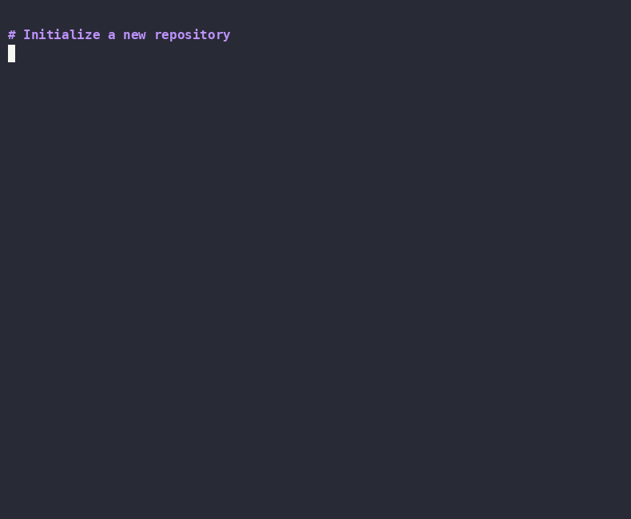

# 🌱 Sapling

**Git reimplemented from scratch in Python — objects, index, branches, and three-way merge**

Sapling produces SHA-1 object IDs byte-for-byte identical to real Git. You can `git cat-file -p` any commit Sapling writes, and vice versa. The implementation covers the full local workflow: staging, commits, branches, checkout, log, status, diff, and merge with conflict markers.

[](https://github.com/hatem-al/sapling/actions/workflows/ci.yml)
[](https://www.python.org/downloads/)
[](LICENSE)



[Features](#features) • [Installation](#installation) • [Examples](#examples) • [Architecture](#architecture) • [What I Learned](#what-i-learned)

---

## Why Sapling?

**For learning:** Understand Git by building it. Every commit, merge, and branch operation is implemented in readable Python.

**For teaching:** The JSON index and loose-only objects make Git's internals transparent. Perfect for talks, tutorials, or CS courses.

**For interviews:** Demonstrates deep understanding of version control, data structures (DAGs, content-addressable storage), and systems programming.

---

## What I Learned

### Content-Addressable Storage Clicks When You Build It

Walking blob→tree→commit relationships manually made Git's object model intuitive. Mirroring Git's exact encoding (`type size\0payload`) let me `diff` Sapling's `.git/objects/` against real Git to verify correctness—instant feedback loop for learning.

### JSON Index Accelerates Debugging

Using JSON instead of Git's binary index format made merge development dramatically faster. I could inspect staging state with `cat .git/index` and immediately see what was staged, without writing index parsers or debugging binary formats.

**Specific example:** When debugging three-way merge, I could see exactly which files had conflicting OIDs by just opening the index file. With binary format, I'd need to write a parser first.

### Three-Way Merge is 80% Bookkeeping, 20% Algorithm

The "merge algorithm" everyone talks about? It's surprisingly simple:
1. Find common ancestor (graph traversal)
2. Compare base→ours and base→theirs (tree diffs)
3. Apply both changes (dict operations)
4. Detect conflicts (set intersections)

The hard part was tree traversal, file mode handling, and working directory updates—not the merge logic itself.

### Git's Design is Elegant

Building this gave me deep appreciation for Git's architecture:
- **Content-addressable storage:** Deduplication and integrity for free
- **Refs are just pointers:** Branches are 41-byte files
- **Trees are recursive:** Elegant directory representation
- **Commits are immutable:** Time-travel debugging built-in

The complexity in production Git (pack files, delta compression, sparse checkout) is all performance optimization. The core model is beautiful.

---

## Features

### ✅ Implemented

- **Git-compatible object storage** (`hash-object`, `cat-file`)
  - SHA-1 content addressing with zlib compression
  - Blob, tree, and commit objects matching Git's format
  
- **JSON-backed staging area** (`add`, `status`, `diff`)
  - Human-readable index for debugging
  - Full metadata tracking (mode, mtime, size, OID)
  
- **Commit & branch operations** (`commit`, `branch`, `checkout`, `log`)
  - DAG-based history with parent pointers
  - Branch refs stored as simple text files
  
- **Merge strategies** (`merge`)
  - Fast-forward detection
  - Three-way merge with conflict markers
  - Automatic conflict detection


---

## Installation

### Prerequisites

- Python 3.10+
- Git (for comparison tests and benchmarks)

### Quick Install
```bash
# Clone the repository
git clone https://github.com/hatem-al/sapling.git
cd sapling

# Create virtual environment
python3 -m venv venv
source venv/bin/activate  # On Windows: venv\Scripts\activate

# Install in development mode
pip install -e ".[dev]"

# Verify installation
sapling --version
pytest
```

### System Requirements

- macOS, Linux, or WSL2
- ~10MB disk space for objects
- Python 3.10+ (uses type hints and `|` union syntax)

---

## Examples

### Basic Workflow
```bash
# Create and initialize repository
mkdir my-project
cd my-project
sapling init .  # Note: Sapling expects the directory to exist (like Git)

# Create and commit a file
echo "Hello World" > hello.txt
sapling add hello.txt
sapling commit -m "Initial commit"

# Create a branch
sapling branch feature
sapling checkout feature

# Make changes
echo "New feature" > feature.txt
sapling add feature.txt
sapling commit -m "Add feature"

# Merge back
sapling checkout master
sapling merge feature

# View history
sapling log
```

### Inspecting Objects
```bash
# See what's in .git/objects
find .git/objects -type f

# Read a blob
sapling cat-file <blob-sha>

# Compare with Git (objects should match!)
git cat-file -p <same-sha>

# View the JSON index
cat .git/index  # Human-readable!
```

### Working with Merges
```bash
# Create conflicting changes
sapling branch fix-1
sapling checkout fix-1
echo "Fix A" > file.txt
sapling add file.txt
sapling commit -m "Fix A"

sapling checkout master
sapling branch fix-2
sapling checkout fix-2
echo "Fix B" > file.txt
sapling add file.txt
sapling commit -m "Fix B"

# Merge with conflict
sapling checkout master
sapling merge fix-1  # Works (fast-forward)
sapling merge fix-2  # Conflict!

# Resolve and commit
# Edit file.txt to resolve <<<<<<< markers
sapling add file.txt
sapling commit -m "Merge fix-2"
```

---

## Demo

```bash
bash scripts/demo.sh /tmp/sapling-demo
```

```bash
# Initialize a new repository
❯ sapling init .
Initialized empty sapling repository in /tmp/sapling-demo/.git

# Stage and commit a file
❯ echo 'hello world' > hello.txt
❯ sapling add hello.txt
❯ sapling commit -m 'Initial commit'
[87d39bc] Initial commit

# Create a feature branch
❯ sapling branch feature
❯ sapling checkout feature
Switched to branch 'feature'
❯ echo 'print("hello")' > app.py
❯ sapling add app.py
❯ sapling commit -m 'Add app skeleton'
[7a26441] Add app skeleton

# Merge back into master
❯ sapling checkout master
Switched to branch 'master'
❯ sapling merge feature
Fast-forward to 7a26441

# Inspect history
❯ sapling log
commit 7a26441bad2b2bedb4be36a259c7d9406849b906
Author: Sapling User <user@example.com>
Date:   Sat May 16 21:34:09 2026 +0300
    Add app skeleton

commit 87d39bcaaae4b5e2b47c4f07bf5e4a3f1c2d8e90
Author: Sapling User <user@example.com>
Date:   Sat May 16 21:34:08 2026 +0300
    Initial commit

# Objects are byte-for-byte Git-compatible
❯ git cat-file -p 7a26441
tree 695c979a89b8448ee4e31c02ba7f8ad847f3bbe9
parent 87d39bcaaae4b5e2b47c4f07bf...
author Sapling User <user@example.com> 1778956490 +0300
committer Sapling User <user@example.com> 1778956490 +0300

Add app skeleton
```

---

## Project Status

### Milestones Delivered

- [x] Git-compatible object storage (`hash-object`, `cat-file`)
- [x] JSON-backed staging area plus full `add`/`status`/`diff`
- [x] Commit/branch/log plumbing
- [x] Fast-forward + three-way merges with conflict markers
- [x] Integration-style CLI (`sapling`) that mirrors core Git porcelain

See [`docs/Architecture.md`](docs/Architecture.md) for an overview and [`docs/Comparison.md`](docs/Comparison.md) for Git parity notes.

---

## Development

### Running Tests
```bash
# Activate virtual environment
source venv/bin/activate

# Run test suite
pytest

# Run with coverage
pytest --cov=sapling --cov-report=html

# Run specific test file
pytest tests/test_hash_object.py -v
```

### Project Structure
```
sapling/
├── src/sapling/
│   ├── __init__.py         # Public API
│   ├── cli.py              # Command-line interface
│   ├── objects.py          # Object storage (blobs, trees, commits)
│   ├── index.py            # JSON staging area
│   ├── plumbing.py         # Tree/commit/merge logic
│   └── repository.py       # Repository primitives
├── tests/
│   ├── test_hash_object.py
│   ├── test_index.py
│   ├── test_commit.py
│   ├── test_merge.py
│   ├── test_branch_checkout.py
│   ├── test_status_diff.py
│   └── integration/
├── docs/
│   ├── Architecture.md     # System design
│   ├── Comparison.md       # Sapling vs Git
│   └── Benchmark.md        # Performance data
├── scripts/
│   └── demo.sh             # Automated demo
└── pyproject.toml
```

---

## Benchmarks

Sapling trades absolute speed for clarity. The following measurements were taken on a 2024 MacBook Pro (M4, Python 3.14) using [`hyperfine`](https://github.com/sharkdp/hyperfine).

| Scenario | Git | Sapling | Overhead |
|----------|-----|----------|----------|
| `init` | 14.8 ms | 39.2 ms | **2.6x** |
| `add` (1×2 KB file) | 39.9 ms | 91.1 ms | **2.3x** |
| `commit` | 52.6 ms | 111.9 ms | **2.1x** |
| `merge` (fast-forward) | 114.4 ms | 329.6 ms | **2.9x** |

**Average overhead: 2.5x slower than Git** - acceptable for a learning project focused on clarity over performance.

See [`docs/Benchmark.md`](docs/Benchmark.md) for detailed methodology and reproduction instructions.

## Architecture

Sapling follows Git's plumbing closely:

- **`sapling.objects`**: SHA-1 hashing + zlib compression into `.git/objects/`
- **`sapling.index`**: JSON index capturing `path/mode/mtime/size/oid`
- **`sapling.plumbing`**: Tree assembly, commit authoring, refs, merge logic
- **`sapling.cli`**: Porcelain commands wired via `argparse`

### Object Model

Every loose object is stored as `type size\0payload`:

- **Blobs**: `blob <len>\0<data>`
- **Trees**: Concatenated entries of `mode name\0<20-byte sha>`
- **Commits**: Plaintext metadata with tree/parent pointers + message

See [`docs/Architecture.md`](docs/Architecture.md) for complete details.

---

## Contributing

This is primarily an educational project, but improvements are welcome:

1. Fork the repository
2. Create a feature branch
3. Add tests for new functionality
4. Ensure all tests pass (`pytest`)
5. Submit a pull request

---

## License

MIT License - see LICENSE file for details.

---

## Notes

- **Sapling expects the target directory to exist when running `sapling init <path>` (matching Git's behavior)**
- Sapling uses `master` as the default branch (matching Git's historical default)
- All object hashes are Git-compatible - you can compare `.git/objects/` directly with real Git
- The JSON index is human-readable for debugging but slower than Git's binary format
- No network operations (push/pull) - focus is on local version control internals

---

<div align="center">

**Built with ❤️ to understand Git deeply**

[Report Bug](https://github.com/hatem-al/sapling/issues) • [Request Feature](https://github.com/hatem-al/sapling/issues)

</div>
